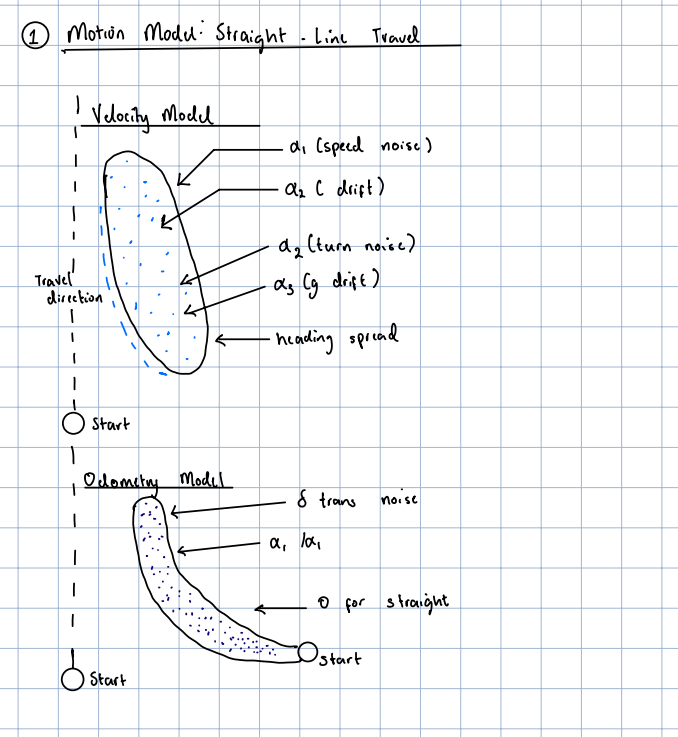
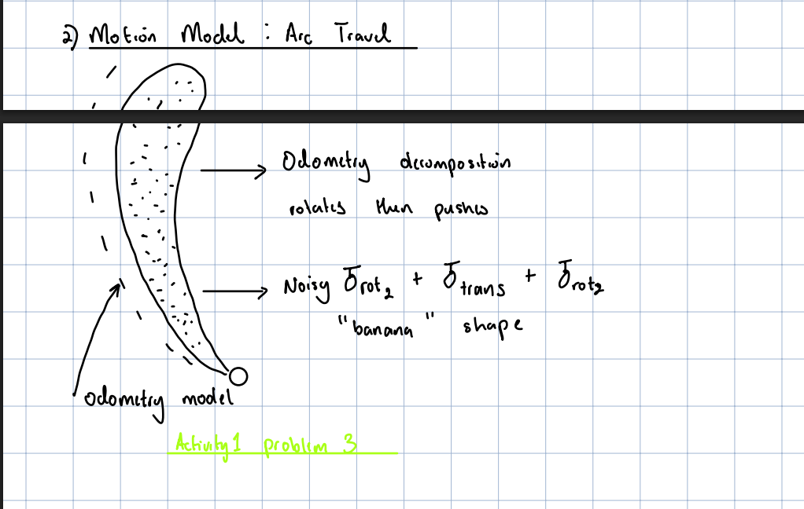
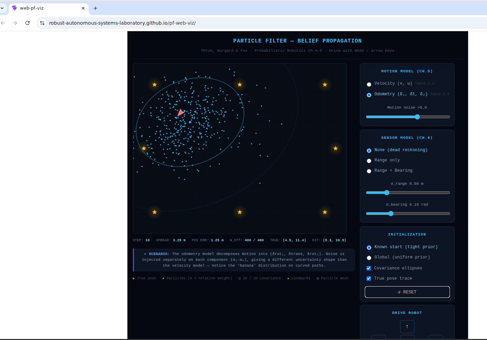
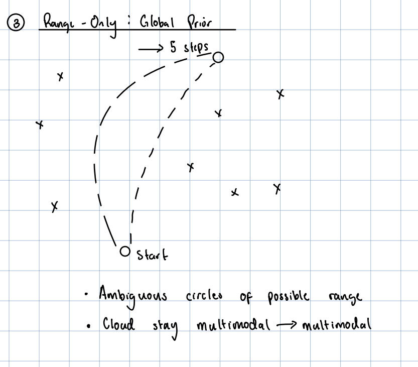
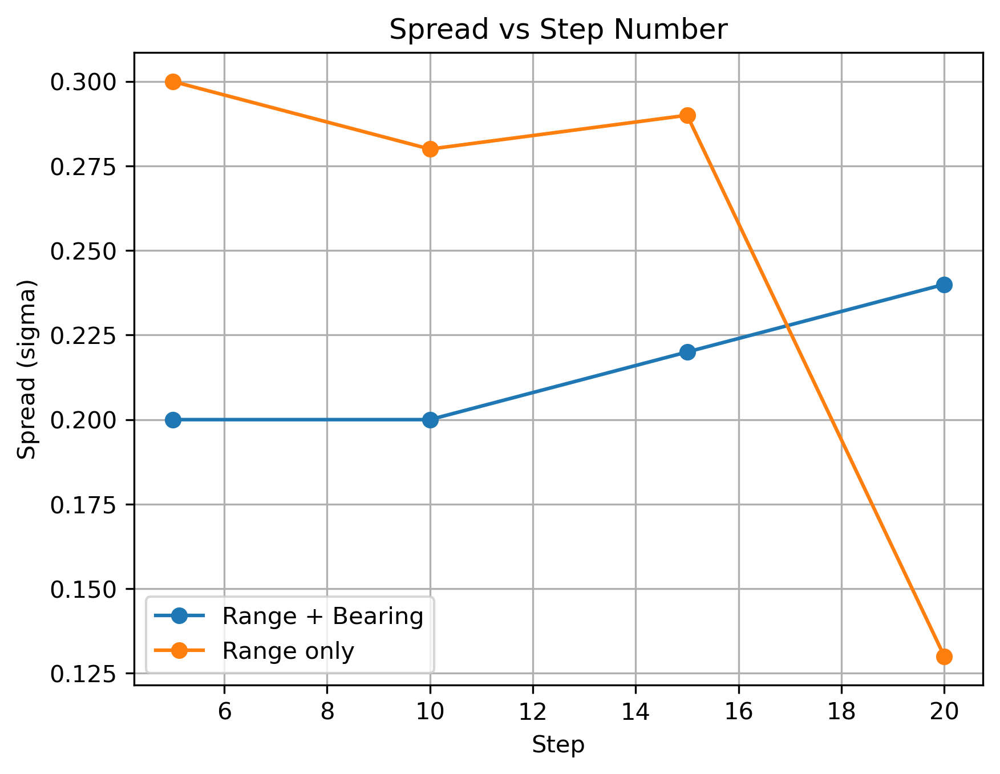

# EE5531 Homework 2: Particle Filter Belief Propagation

## Activity 1 – Motion Model Noise Geometry

### Problem 1

#### Velocity model prediction
For the velocity motion model, I expect the particle cloud after 10 straight steps to form an elongated ellipse whose major axis is aligned with the direction of travel. Noise in the linear velocity causes some particles to move farther than others, so it dominates the spread along the path. Noise in angular velocity and heading drift creates small orientation errors that later produce lateral displacement, so these terms dominate the spread perpendicular to the path. Because forward displacement error accumulates directly at each step, the along-track axis should be longer than the sideways axis.

#### Odometry model prediction
For the odometry motion model, I also expect an elongated cloud after 10 straight steps, but the shape is produced through the noisy decomposition into δrot₁, δtrans, and δrot₂. Noise in δtrans creates spread along the motion direction because particles translate by slightly different amounts. Noise in δrot₁ changes the direction of the translation itself, so it contributes strongly to lateral spread. Noise in δrot₂ mainly affects the final heading and has a weaker immediate effect on position than δrot₁ during straight-line motion.

### Problem 2

The velocity-model cloud matched my prediction reasonably well: it appeared elongated in the direction of travel, with smaller sideways spread caused by heading-related noise. The odometry-model cloud was also elongated, but its internal geometry reflects the rotate-translate-rotate decomposition. Small discrepancies from the ideal sketches are expected because the belief is represented by a finite number of particles and summarized visually with a covariance ellipse. Random sampling effects and repeated resampling can also make the cloud appear slightly irregular instead of perfectly elliptical.

### Problem 3

Before running the simulator, I expected the odometry model to produce a banana-shaped particle cloud. The reason is that noise in δrot₁ changes the direction of the subsequent translation, so particles that all translate by similar distances can still land along a curved arc. This creates a bent endpoint envelope rather than a straight or purely elliptical spread.

The odometry model produced the more pronounced banana distribution. Its rotate-translate-rotate decomposition creates the curved geometry naturally because the translation happens after the initial noisy rotation. The velocity model also produces spread on a curved path, but the uncertainty is injected through noisy v and ω rather than through a noisy pre-translation rotation, so the banana shape is usually less pronounced.

### Problem 4

At 5× motion noise, the covariance ellipse becomes a weaker summary of the true belief. In the high-noise odometry run, the particle cloud spreads out significantly and is no longer tightly concentrated around a single compact Gaussian-like region. The ellipse still provides a rough second-order summary, but it does not fully capture the irregular structure of the actual particle distribution.

This implies a limitation of EKF-based localization under high motion noise. EKF represents uncertainty using only a mean and covariance, so it cannot accurately represent strongly non-Gaussian beliefs, especially when nonlinear motion causes the sample cloud to become skewed, stretched, or curved. Particle filters and other nonparametric belief representations are better suited to this regime because they can represent arbitrary belief shapes directly through weighted particles.

## Activity 2 – Information Content and the Value of Bearing

### Problem 1

Starting from a global prior under range-only sensing, I expect the particle cloud after 5 forward steps to remain multimodal rather than collapsing to one tight cluster. A range measurement constrains the robot to lie on a circle around each landmark, so the consistent regions are where multiple circular constraints intersect. With 8 landmarks arranged symmetrically, more than one part of the map can produce similar range measurements to all visible landmarks. Because range provides distance but not direction, the remaining cloud should still show multiple plausible hypotheses.

### Problem 2

| Step | N_eff (Range+Bearing) | Spread σ (Range+Bearing) | N_eff (Range only) | Spread σ (Range only) |
|------|------------------------|--------------------------|--------------------|------------------------|
| 5    | 400                    | 0.20                     | 400                | 0.30                   |
| 10   | 400                    | 0.20                     | 400                | 0.28                   |
| 15   | 400                    | 0.22                     | 400                | 0.29                   |
| 20   | 400                    | 0.24                     | 400                | 0.13                   |

In this experiment, the Range + Bearing configuration stayed tightly localized throughout the run, with spread values between 0.20 m and 0.24 m. The Range-only configuration began with larger uncertainty, showing spreads of 0.30 m, 0.28 m, and 0.29 m at steps 5, 10, and 15 before tightening to 0.13 m by step 20. Overall, the early and mid-run results support the expectation that bearing information improves localization by adding directional constraints beyond distance alone.

### Problem 3
The Range + Bearing configuration is expected to localize more effectively because bearing removes geometric ambiguity that range alone cannot resolve as quickly. A range measurement constrains the robot to lie on a circle around a landmark, so multiple positions may still be consistent with several range measurements, especially in a symmetric map. When bearing is added, the particle weights also depend on directional agreement with the landmarks, which more strongly penalizes particles with the wrong angular relationship.

The recorded results generally match this explanation. At steps 5, 10, and 15, the Range + Bearing spread is consistently lower than the Range-only spread, which indicates a tighter belief. Although the Range-only run becomes very tight by step 20, the earlier checkpoints still show that range-only sensing leaves more uncertainty for longer than the combined range-and-bearing model.

### Problem 4
When σ_bearing is increased to 0.5 rad, the bearing likelihood becomes much broader, so particles with noticeably different bearing predictions can still receive similar weights. As a result, the bearing measurement contributes less discrimination than it does under the default setting.

A practical criterion for deciding when bearing stops meaningfully helping is whether the Range + Bearing run becomes almost indistinguishable from the Range-only run in observable quantities such as spread, cloud compactness, and post-update N_eff behavior. If those quantities no longer show a clear advantage over Range only, then the bearing term is no longer adding substantial localization information and the update is being dominated mainly by the range measurements.
