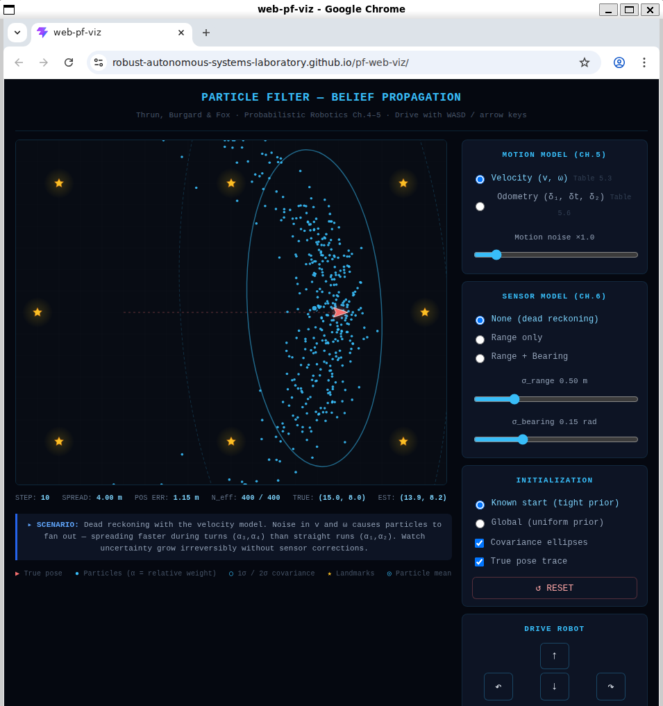
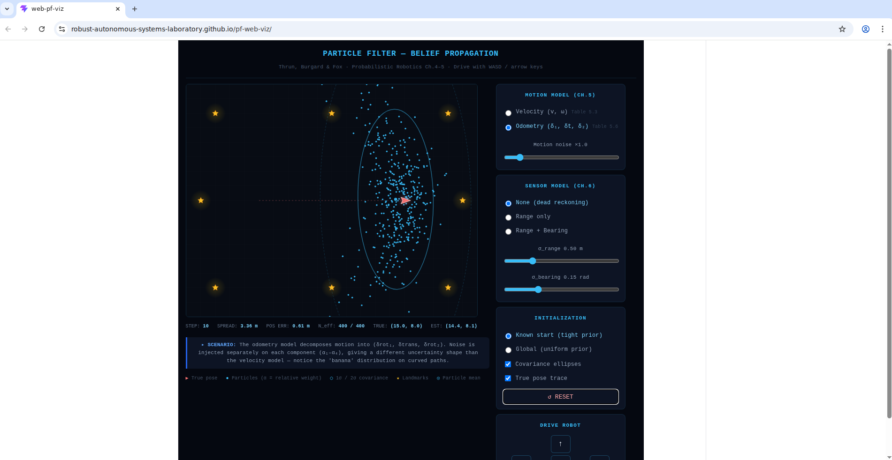
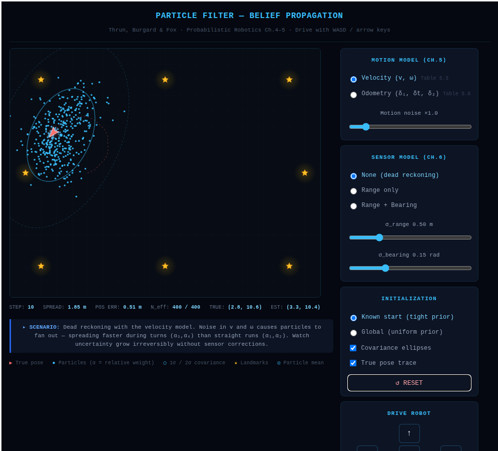
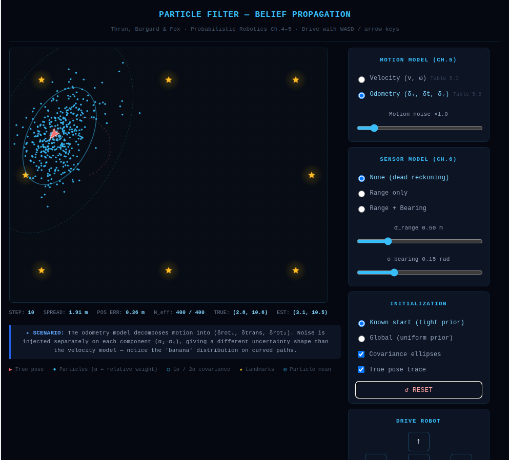

# EE5531 Homework 2: Particle Filter Belief Propagation

## Activity 1

### Problem 1
[Insert your prediction sketches and explanation here.]

### Problem 2

#### Velocity model — 10 straight steps

#### Odometry model — 10 straight steps

After running 10 straight steps with the sensor model disabled and motion noise set to 1×, both motion models produced particle clouds that were approximately elliptical. In both cases, the major axis of the ellipse was aligned with the dominant direction of accumulated uncertainty, which matched the general prediction of elongated spread after repeated motion updates. The velocity model produced a slightly larger spread, while the odometry model appeared somewhat tighter in this trial. The overall orientations were similar, but the exact amount of spread differed because the two models inject noise at different points in the motion computation.

### Problem 3

#### Pre-run sketch
[Insert your hand-drawn or digital banana-distribution sketch here.]

#### Velocity model — 10-step circular arc

#### Odometry model — 10-step circular arc

In the curved-motion experiment, both motion models produced particle clouds that were no longer purely straight ellipses. However, the odometry model showed a more pronounced banana-like curvature than the velocity model. This happens because the odometry model decomposes motion into an initial rotation, a translation, and a final rotation. Noise in the initial rotation changes the direction of the following translation, so the set of possible endpoints bends along a curved envelope. In contrast, the velocity model injects noise directly into linear and angular velocity, which can still create curved uncertainty, but it does not produce the banana distribution as naturally as the rotate-translate-rotate decomposition.
### Problem 4
[Insert high-noise screenshot and explanation.]

## Activity 2

### Problem 1
[Insert your range-only sketch and explanation.]

### Problem 2
[Insert your N_eff/spread table and spread plot.]

### Problem 3
[Insert explanation of the two curves.]

### Problem 4
[Insert noisy bearing explanation.]
